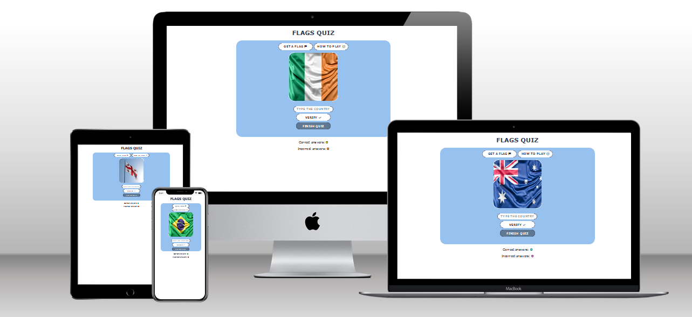
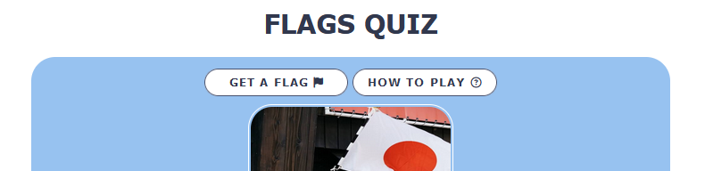
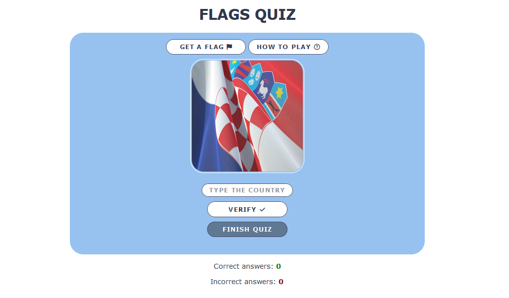

# Flags Quiz

Flags Quiz is a game to help people learn flags of different countries. This game is mainly targeted towards students for their geography studies and anyone interested. This game checks general geography knowledge, helps to learn flags, practise and  have fun.

#### [The link to see the quiz](https://natalitta.github.io/flags-quiz/)

## Existing Features

### The Header
* Featured on the top of the page, the header states the name of the game: Flags Quiz.
* The user can easily anderstand what the quiz is about.

### The quiz game area
* The game gives instructions: 1) click the button "Get a flag" 2) type an answer in the input "Type the country" 3) click the button "Verify" to check the answer.
* There's also an opportunity to get a new flag image by clicking on the image itself, it can be handy for mobile users.
* A user can use any type of case for the input, all variants will be scored as correct (e.g. Canada, canada or CANADA).

### The quiz results
* When users click on the button "Get a flag" or tap on the image they get a new flag image shown randomly by JavaScript. 
* Then users type the country they think this flag belongs to and submit their answer. If the answer is correct, an alert pops up: "Well done! You got it right!" and the score of correct answers increases. If the answer is wrong, an alert pops up: "Awww... you answered... (user's answer). The correct country was ... (the correct country name)!" and the score of incorrect answers increases.
* The results and the score are easy to understand because correct answers are coloured green and wrong ones red.

### Favicon
* The site has a favicon implemented with a flag. It shows an image in a browser tab so that the user can easily identify the website among other open tabs.

## Features Left to Implement

* I would like to add all world countries' flags in the future.

## Testing
#### The testing was done in browsers: 
* Mozilla Fireworks 108.0.2
* Google Chrome 106.0.5249.119
* Microsoft Edge 108.0.1462.54
  
#### Smartphones: 
* Pixel 4a
* Xiomi Redmi 8.

#### Responsiveness was also tested via Developers tools for:
* iPhone 12 Pro
* iPad iPadOS 14.7.11
* Gallaxy Note 20 Android 11
* iPhone SE 2nd gen iOS 14.6
* Samsung Gallaxy A51/71

#### I confirmed that the quiz results are always correct. I confirmed that all buttons and the input are clickable.

### Validator Testing
* HTML: No errors were shown when passing through the official W3C HTML validator.

* CSS: No errors were found when passing through the official W3C CSS validator.

### Unfixed Bugs
No unfixed bugs.

## Deployment
The site was created using Gitpod and pushed to GitHub to a remote repository.
#### The site was deployed to GitHub pages. The steps to deploy are as follows: 
* In the GitHub repository, navigate to the Settings tab.
* From the menu on the left, select Pages.
* From the source section drop-down menu, select the Branch: main.
* Click 'Save'
* A live link displays on the top of the section when published successfully.

#### The live link can be found here - https://github.com/Natalitta/flags-quiz

## Credits

### Content:
* All icons were taken from Font Awesome.

### Media
* The photos for the quiz were taken from free Internet resources (Unsplash and Freepik websites):
* Irish flag by www.slon.pics on Freepik
* Ukrainian flag on Freepik
* Spanish flag Photo by Max Harlynking on Unsplash
* Canadian flag Photo by Praveen Kumar Nandagiri on Unsplash 
* German flag Photo by Mark König on Unsplash
* Japanese flag Photo by Markus Winkler on Unsplash
* Moroccan flag Photo by Alexander Schimmeck on Unsplash 
* French flag Image by jannoon028 on Freepik
* Brazilian flag Photo by www.slon.pics on Freepik
* Australian flag Photo by Caleb Russell on Unsplash
* Croatian flag Photo by Arcode ACD on Unsplash 
* Indian flag Photo by Onkarphoto on Unsplash
* Argentinian flag Photo by Angelica Reyes on UnsplashGeorgia flag 
* Georgian flag Photo by Zura Narimanishvili on Unsplash
* Cambodian flag Photo by aboodi vesakaran on Unsplash

